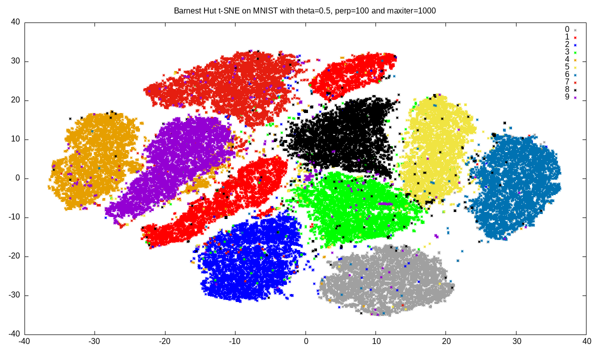

+++
title = "Release 0.4.0"
date = "2021-04-28"
+++

Linfa's 0.4.0 release introduces four new algorithms, improves documentation of the ICA and K-means implementations, adds more benchmarks to K-Means and updates to ndarray's 0.14 version.

<!-- more -->

## New algorithms

The [Partial Least Squares Regression](https://en.wikipedia.org/wiki/Partial_least_squares_regression) model family is added in this release. It projects the observable, as well as predicted variables to a latent space and maximizes the correlation for them. For problems with a large number of targets or collinear predictors it gives a better performance when compared to standard regression. For more information look into the documentation of `linfa-pls`.

A wrapper for Barnes-Hut t-SNE is also added in this release. The t-SNE algorithm is often used for data visualization and projects data in a high-dimensional space to a similar representation in two/three dimension. It does so by maximizing the Kullback-Leibler Divergence between the high dimensional source distribution to the target distribution. The Barnes-Hut approximation improves the runtime drastically while retaining the performance. Kudos to [github/frjnn](https://github.com/frjnn/) for providing an implementation!

A new preprocessing crate makes working with textual data and data normalization easy. It implements _count-vectorizer_ and _IT-IDF_ normalization for text pre-processing. Normalizations for signals include linear scaling, norm scaling and whitening with PCA/ZCA/choelsky. An example with a Naive Bayes model achieves 84% F1 score for predicting categories `alt.atheism`, `talk.religion.misc`, `comp.graphics` and `sci.space` on a news dataset.

[Platt scaling](https://en.wikipedia.org/wiki/Platt_scaling) calibrates a real-valued classification model to probabilities over two classes. This is used for the SV classification when probabilities are required. Further a multi class model, combining multiple binary models (e.g. calibrated SVM models) into a single multi-class model is also added. These composing models are moved to the `linfa/src/composing/` subfolder.

## Improvements

Numerous improvements are added to the KMeans implementation, thanks to @YuhanLiin. The implementation is optimized for offline training, an incremental training model is added and KMeans++/KMeans|| initialization gives good initial cluster means for medium and large datasets.

We also moved to ndarray's version 0.14 and introduced `F::cast` for simpler floating point casting. The trait signature of `linfa::Fit` is changed such that it always returns a `Result` and error handling is added for the `linfa-logistic` and `linfa-reduction` subcrates.

You often have to compare several model parametrization with k-folding. For this a new function `cross_validate` is added which takes the number of folds, model parameters and a closure for the evaluation metric. It automatically calls k-folding and averages the metric over the folds. To compare different L1 ratios of an elasticnet model, you can use it in the following way:
```rust
// L1 ratios to compare
let ratios = vec![0.1, 0.2, 0.5, 0.7, 1.0];

// create a model for each parameter
let models = ratios
    .iter()
    .map(|ratio| ElasticNet::params().penalty(0.3).l1_ratio(*ratio))
    .collect::<Vec<_>>();

// get the mean r2 validation score across 5 folds for each model
let r2_values =
    dataset.cross_validate(5, &models, |prediction, truth| prediction.r2(&truth))?;

// show the mean r2 score for each parameter choice
for (ratio, r2) in ratios.iter().zip(r2_values.iter()) {
    println!("L1 ratio: {}, r2 score: {}", ratio, r2);
}
```

### Other changes

 * fix for border points in the DBSCAN implementation
 * improved documentation of the ICA subcrate
 * prevent overflowing code example in website

## Barnes-Hut t-SNE

This example shows the use of `linfa-tsne` with the MNIST digits dataset. We are going to load the MNIST dataset, then reduce the dimensionality with PCA to an embedding of 50 dimension and finally apply Barnes-Hut t-SNE for a two-dimensional embedding. This embedding can be plotted to give the following image:



I won't go into details how to load the MNIST dataset, but we are using the excellent [crates.io/mnist](https://crates.io/crates/mnist) crate here to help us downloading and representing the images in a proper vector representation.

```rust
// use 50k samples from the MNIST dataset
let (trn_size, rows, cols) = (50_000, 28, 28);

// download and extract it into a dataset
let Mnist { images, labels, .. } = MnistBuilder::new()
    .label_format_digit()
    .training_set_length(trn_size as u32)
    .download_and_extract()
    .finalize();
```

The image brightness information `images` and corresponding `labels` are then used to construct a dataset.

```rust
// create a dataset from magnitudes and targets
let ds = Dataset::new(
    Array::from_shape_vec((trn_size, rows * cols), images)?.mapv(|x| (x as f64) / 255.),
    Array::from_shape_vec((trn_size, 1), labels)?
);
```

In a preliminary step this brightness information is transformed from a 784 dimensional vector representation to a 50 dimensional embedding with maximized variance. The Principal Component Analysis uses LOBPCG for an efficient implementation. No whitening is performed as this hurts the results.

```rust
let ds = Pca::params(50).whiten(false).fit(&ds).transform(ds);
```

Then t-SNE is used to project those 50 dimensions in a non-linear way to retain as much of the structural information as possible. We will use a Barnes-Hut approximation with `theta=0.5`. This performs a space partitioning and combines regions very far away from the corresponding point to reduce the required runtime. The value theta can go from zero to one with one the original non-approximate t-SNE algorithm. We will also cap the runtime to a thousand iterations:

```rust
let ds = TSne::embedding_size(2)
    .perplexity(50.0)
    .approx_threshold(0.5)
    .max_iter(1000)
    .transform(ds)?;
```

The resulting embedding can then be written out to a file and plotted with `gnuplot`:

```rust
let mut f = File::create("examples/mnist.dat").unwrap();

for (x, y) in ds.sample_iter() {
    f.write(format!("{} {} {}\n", x[0], x[1], y[0]).as_bytes())
        .unwrap();
}
```

You can find the full example at [algorithms/linfa-tsne/examples/mnist.rs](https://github.com/rust-ml/linfa/blob/master/algorithms/linfa-tsne/examples/mnist.rs) and run it with 
```
$ cargo run --example  mnist --features linfa/intel-mkl-system --release
```

## Preprocessing text data with TF-IDF and `linfa-preprocessing`

Let's move to a different example. This release sees the publication of the first `linfa-preprocessing` version which already includes many algorithms suitable for text processing. We will try to predict the topic of a newspaper article with Gaussian Naive Bayes algorithm. Prior to training such a model, we need to somehow extract continuous embeddings from the text. With a number of sample files `training_filenames` we can use `linfa-preprocessing` to construct a vocabulary by calling:

```rust
let vectorizer = TfIdfVectorizer::default()
    .fit_files(&training_filenames, ISO_8859_1, Strict)?;

println!(
    "We obtain a vocabulary with {} entries",
    vectorizer.nentries()
);  

// construction of targets and dataset omitted here
let training_dataset = //...
```

This vocabulary can then be used to extract an embedding for a text file. The Naive Bayes algorithm does not work with sparse matrices, so we have to make the embedding matrix dense.

```rust
let training_records = vectorizer
  .transform_files(&training_filenames, ISO_8859_1, Strict)
  .to_dense();
```

The Gaussian Naive Bayes is trained with the default parameters and the dataset passed for training: (the construction of the targets is omitted here)
```rust
let model = GaussianNbParams::params().fit(&training_dataset)?;
let training_prediction = model.predict(&training_dataset);

let cm = training_prediction
    .confusion_matrix(&training_dataset)?;

// this gives an F1 score of 0.9994
println!("The fitted model has a training f1 score of {}", cm.f1_score());   
```

To evaluate the model we have a second set of `test_filenames` which are again transformed to its dense embedding representation. The Gaussian Naive Bayes model is then used to predict the targets. The confusion matrix and F1 score measures its performance.

```rust
let test_records = vectorizer
    .transform_files(&test_filenames, ISO_8859_1, Strict)
    .to_dense();

// get targets and construct testing dataset 
// ...

// predict the testing targets
let test_prediction: Array1<usize> = model.predict(&test_dataset);

// create a confusion matrix and print F1 score
let cm = test_prediction.confusion_matrix(&test_dataset)?
println!("{:?}", cm);                                                                                                                                                                  

// the evaluation gives an F1 score of 0.8402
println!("The model has a test f1 score of {}", cm.f1_score());
```

You can find the full example at [algorithms/linfa-preprocessing/examples/tfidf_vectorizer.rs](https://github.com/rust-ml/linfa/blob/master/algorithms/linfa-preprocessing/examples/tfidf_vectorization.rs) and run it with 
```
$ cargo run --example tfidf_vectorizer --release

```
