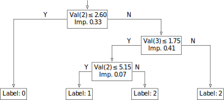

# Decision tree learning

`linfa-trees` provides methods for decision tree learning algorithms.

## The Big Picture

`linfa-trees` is a crate in the [`linfa`](https://crates.io/crates/linfa) ecosystem, an effort to create a toolkit for classical Machine Learning implemented in pure Rust, akin to Python's `scikit-learn`.

Decision Trees (DTs) are a non-parametric supervised learning method used for classification and regression. The goal is to create a model that predicts the value of a target variable by learning simple decision rules inferred from the data features.

## Current state

`linfa-trees` currently provides an implementation of single tree fitting

## Examples

There is an example in the `examples/` directory on how to use decision trees. To run, use:

```bash
$ cargo run --release --example decision_tree --features linfa/intel-mkl-system
```

This generates the following tree:
<p align="center">
   
</p>

## License
Dual-licensed to be compatible with the Rust project.

Licensed under the Apache License, Version 2.0 <http://www.apache.org/licenses/LICENSE-2.0> or the MIT license <http://opensource.org/licenses/MIT>, at your option. This file may not be copied, modified, or distributed except according to those terms.
